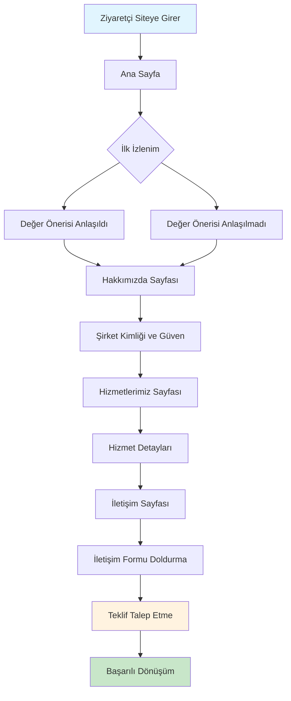
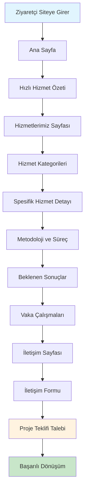
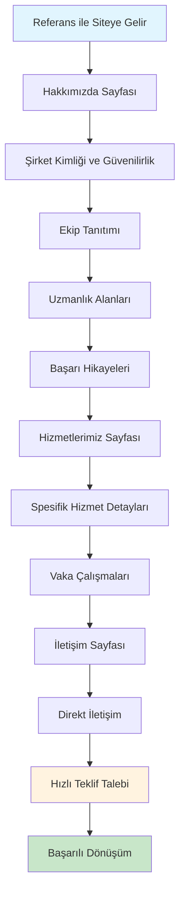

# Koru Impact - Site Haritası ve Kullanıcı Akışı Tasarımı

## 📋 Site Haritası (Sitemap)

```
Koru Impact Web Sitesi
├── 🏠 Ana Sayfa (Homepage)
│   ├── Hero Section
│   ├── Değer Önerisi
│   ├── Hızlı Hizmet Özeti
│   ├── Güven Oluşturma
│   └── CTA Butonları
│
├── ℹ️ Hakkımızda (About Us)
│   ├── Şirket Hikayesi
│   ├── Misyon & Vizyon
│   ├── Uzmanlık Alanları
│   ├── Ekip Tanıtımı
│   ├── Yaklaşım Metodolojisi
│   └── Başarı Hikayeleri
│
├── 🛠️ Hizmetlerimiz (Services)
│   ├── Hizmet Kategorileri
│   ├── Detaylı Hizmet Açıklamaları
│   ├── Metodoloji
│   ├── Süreç Açıklaması
│   ├── Beklenen Sonuçlar
│   └── Vaka Çalışmaları
│
└── 📞 İletişim (Contact)
    ├── İletişim Bilgileri
    ├── İletişim Formu
    ├── Çalışma Saatleri
    ├── Lokasyon
    ├── Sosyal Medya
    └── Hızlı Yanıt Sistemi
```

## 🎯 Kullanıcı Akışı Diyagramları

### A. Yeni Ziyaretçi Akışı (Primary User Journey)



### B. Doğrudan Hizmet Arayan Akışı (Service-Seeking Journey)



### C. Referans ile Gelen Akışı (Referral Journey)



## 📊 Sayfa Detayları ve Kullanıcı Yolculuğu

### 1. Ana Sayfa (Homepage) - İlk İzlenim Noktası

**Kullanıcı Motivasyonu:** "Koru Impact kimdir ve bana nasıl yardımcı olabilir?"

**Kullanıcı Yolculuğu:**
1. **0-3 saniye:** Hero section'da şirket kimliği ve değer önerisi
2. **3-10 saniye:** Hızlı hizmet özeti ve ana faydalar
3. **10-30 saniye:** Güven oluşturma elementleri (referanslar, istatistikler)
4. **30+ saniye:** CTA butonları ile sonraki adıma yönlendirme

**Dönüşüm Noktaları:**
- "Hizmetlerimiz" butonuna tıklama
- "Hakkımızda" butonuna tıklama
- İletişim formuna direkt erişim

### 2. Hakkımızda (About Us) - Güven Oluşturma Sayfası

**Kullanıcı Motivasyonu:** "Bu şirkete güvenebilir miyim?"

**Kullanıcı Yolculuğu:**
1. **Şirket Hikayesi:** Kuruluş amacı ve değerler
2. **Misyon & Vizyon:** Şirketin hedefleri ve gelecek vizyonu
3. **Uzmanlık Alanları:** Sosyal bilimlerdeki spesifik uzmanlıklar
4. **Ekip Tanıtımı:** Kilit personelin profilleri
5. **Yaklaşım Metodolojisi:** Sosyal bilim temelli danışmanlık yaklaşımı
6. **Başarı Hikayeleri:** Öne çıkan projeler ve sonuçlar

**Dönüşüm Noktaları:**
- "Hizmetlerimiz" sayfasına geçiş
- İletişim formuna direkt erişim

### 3. Hizmetlerimiz (Services) - Değer Önerisi Sayfası

**Kullanıcı Motivasyonu:** "Bu hizmetler bana nasıl fayda sağlar?"

**Kullanıcı Yolculuğu:**
1. **Hizmet Kategorileri:** Ana hizmet alanlarının genel bakışı
2. **Detaylı Hizmet Açıklamaları:** Her hizmetin kapsamı ve faydaları
3. **Metodoloji:** Her hizmet için kullanılan sosyal bilim yaklaşımları
4. **Süreç Açıklaması:** Danışmanlık sürecinin adımları
5. **Beklenen Sonuçlar:** Müşterilerin elde edeceği faydalar
6. **Vaka Çalışmaları:** Başarılı proje örnekleri

**Dönüşüm Noktaları:**
- İletişim formuna geçiş
- Teklif talep etme
- Detaylı bilgi isteme

### 4. İletişim (Contact) - Aksiyon Alma Sayfası

**Kullanıcı Motivasyonu:** "Nasıl iletişime geçebilirim?"

**Kullanıcı Yolculuğu:**
1. **İletişim Bilgileri:** Adres, telefon, e-posta
2. **İletişim Formu:** Proje teklifi veya bilgi talebi
3. **Çalışma Saatleri:** Müşteri hizmetleri bilgileri
4. **Lokasyon:** Harita ve ulaşım bilgileri
5. **Sosyal Medya:** Şirketin sosyal medya hesapları
6. **Hızlı Yanıt:** Otomatik onay e-postası

**Dönüşüm Noktaları:**
- İletişim formu doldurma
- Telefon ile arama
- E-posta gönderme

## 🎨 Kullanıcı Deneyimi Tasarım Prensipleri

### 1. Sezgisel Navigasyon
- **Breadcrumb Navigation:** Kullanıcının nerede olduğunu bilmesi
- **Sticky Header:** Kolay sayfa geçişi
- **Footer Links:** Tüm sayfalara hızlı erişim

### 2. İçerik Hiyerarşisi
- **H1-H6 Yapısı:** SEO ve okunabilirlik için
- **Görsel Hiyerarşi:** Önemli bilgilerin vurgulanması
- **Beyaz Alan:** İçeriğin nefes alması

### 3. CTA Stratejisi
- **Primary CTA:** "Teklif Al" veya "İletişime Geç"
- **Secondary CTA:** "Daha Fazla Bilgi" veya "Hizmetlerimiz"
- **Tertiary CTA:** "Hakkımızda" veya "Referanslar"

### 4. Güven Oluşturma Elementleri
- **Sosyal Kanıt:** Müşteri referansları ve başarı hikayeleri
- **Uzmanlık Göstergeleri:** Sertifikalar, ödüller, yayınlar
- **Şeffaflık:** Açık fiyatlandırma ve süreç bilgileri

## 📈 Dönüşüm Optimizasyonu

### A. Sayfa Başına Hedefler
- **Ana Sayfa:** %15-20 "Hizmetlerimiz" tıklama oranı
- **Hakkımızda:** %25-30 "Hizmetlerimiz" geçiş oranı
- **Hizmetlerimiz:** %10-15 "İletişim" geçiş oranı
- **İletişim:** %5-8 form doldurma oranı

### B. A/B Test Önerileri
- Hero section başlık varyasyonları
- CTA buton renkleri ve metinleri
- İletişim formu uzunluğu
- Sayfa düzeni alternatifleri

### C. Analitik Takip
- **Google Analytics:** Sayfa görüntüleme ve geçiş oranları
- **Heatmap Analizi:** Kullanıcı davranışları
- **Conversion Tracking:** Dönüşüm noktaları
- **User Session Recording:** Kullanıcı yolculuğu analizi

## 🔄 Sürekli İyileştirme Döngüsü

1. **Veri Toplama:** Kullanıcı davranışları ve dönüşüm metrikleri
2. **Analiz:** Performans değerlendirmesi ve fırsat tespiti
3. **Hipotez Oluşturma:** İyileştirme önerileri
4. **Test:** A/B testleri ve kullanıcı testleri
5. **Uygulama:** Başarılı değişikliklerin hayata geçirilmesi
6. **Tekrar:** Sürecin sürekli tekrarlanması

---

*Bu dokümantasyon, Koru Impact web sitesinin kullanıcı deneyimi ve dönüşüm optimizasyonu için temel çerçeveyi oluşturmaktadır.* 